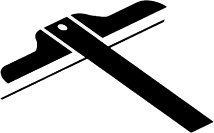

<div align="center">
  

  # Drafting

  **为新时代 vibe coding 设计的软件生产平台**

  规格驱动 · 架构可视化 · AI 协作

  [](https://github.com/shunzhiyimiao/drafting/actions/workflows/build.yml)
  
  
</div>

---

## drafting是什么

Drafting 是给独立开发者(Indie Hacker)用的桌面 IDE,把 AI 协作开发拆成三个层次,各管一摊:

```
想清楚 ─────► 装起来 ─────► 看明白
Blueprint     Patchboard    Atlas
意图层         架构层         现状层
```

- **Blueprint(蓝图)**:用 Markdown 写下意图和验收标准,AI 据此检查代码是否满足
- **Patchboard(接线板)**:图形化的 Socket/Adapter 架构编辑器,直接生成类型安全的装配代码
- **Atlas(地图集)**:只读的代码结构和引用关系浏览器
- **Headquarters(司令部)**:统一的项目入口,告诉你下一步该做什么

四个子系统通过 Sync Bus 事件总线协同,构成完整的 AI 协作开发循环。

## 和 Cursor / Claude Code 有什么不同

主流 AI IDE 的范式是"AI 在编辑器里补全/生成代码"——没有项目级的规格概念,没有架构级的可视化,没有主界面式的项目管理。

Drafting 不试图把这些工具再实现一遍,而是补上它们没有的那一层:**先把意图和架构说清楚,再让 AI 写代码,最后用 AI 看懂自己写的东西**。Patchboard 生成的不是 AI 写的"看起来对"的代码,而是从图形契约里编译出的、可重复生成的装配代码。

完整设计文档见 [CLAUDE.md](./CLAUDE.md)。

## 当前状态

**Pre-alpha,主开发期,请勿用于生产工程。**

| 模块 | v1 完整度 |
|---|---|
| Sync Bus | ✅ 完成 |
| AI Provider Manager | 🚧 ~80%(Anthropic / OpenAI / Ollama / Kimi / Qwen) |
| Patchboard | 🚧 ~75%(Registry + Canvas + 代码生成) |
| Blueprint | 🚧 ~70%(双视图 + AI 检查) |
| Editor + LSP | 🚧 ~70% |
| Headquarters | 🚧 ~70% |
| Terminal / Git | 🚧 ~55% |
| Atlas(仅 File Map) | 🚧 ~50% |

## 快速开始

依赖:Node 20+、pnpm、Rust toolchain(stable)。

```bash
pnpm install
pnpm tauri dev
```

打包:

```bash
pnpm tauri build
```

## 技术栈

- **桌面壳**:Tauri 2
- **后端**:Rust(tokio + reqwest + git2 + portable-pty)
- **前端**:React + TypeScript + Vite + Zustand
- **编辑器**:Monaco + LSP
- **代码生成**:ts-morph(通过 Node 子进程,详见 `packages/codegen-server`)

## 路线图

- **v1**(进行中):TypeScript 工程支持,本地 LSP,主流 AI provider
- **v1.5**:Atlas Reference Map / Module Map,Type Bridge L3
- **v2**:多语言支持,逆向(代码 → 图)

## License

TBD(发布前确定)
